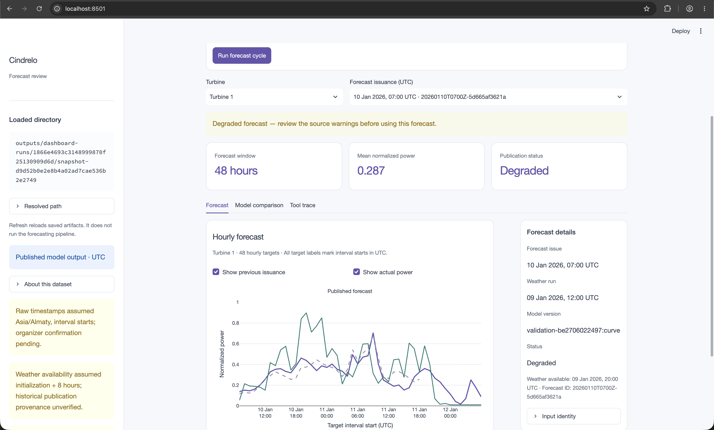

# Cindrelo — wind power forecasting

Hourly normalized-power forecasts for two wind turbines, driven by archived weather. A bounded OpenAI tool controller fetches weather, prepares data, validates temporal eligibility, runs a numerical model, compares revisions and publishes dashboard files. The same guarded tools also run deterministically without an API key.

**Implemented:** data preparation, weather caching, December model selection, January holdout evaluation, February replay, agent execution/recovery, real dashboard examples, an offline demonstration, and a Streamlit dashboard with a one-click forecast cycle, forecasts, revisions, actuals, metrics and tool traces.

**Limitations:** source timezone and interval convention are assumed; weather publication delay is assumed; the archive's historical as-issued provenance is unverified. Forecasts carry `degraded` status and visible warnings. February has no supplied observations, so no February accuracy is claimed.



## Quick start

Tested with Python 3.14.7 on macOS ARM64. Run from the repository root:

```sh
python3 -m venv .venv
source .venv/bin/activate
python -m pip install -r requirements-backend.txt
python -m src demo
```

`demo` **recomputes** two real January forecasts from the bundled empirical curve and four cached weather responses. It needs no network, API key or prior training. Outputs go to `outputs/offline-demo/`. Running it again skips numerical prediction for unchanged inputs. The included source turbine CSVs supply actuals.

The UI can immediately consume `examples/dashboard/`: 192 genuine forecast rows, matching actuals, measured January metrics, and traces from two successful live OpenAI runs:

```sh
python -m pip install -r requirements-ui.txt
CINDRELO_OUTPUT_DIR=examples/dashboard streamlit run app.py
# Or use freshly recomputed forecasts:
CINDRELO_OUTPUT_DIR=outputs/offline-demo streamlit run app.py
```

Start Streamlit from the repository root so it loads [`.streamlit/config.toml`](.streamlit/config.toml). Horizon uses an explicit light theme for native controls and text, including on machines with a dark system preference. After updating this file, stop Streamlit with `Ctrl+C`, restart it, and reload the browser. The [Streamlit theme configuration](https://docs.streamlit.io/develop/concepts/configuration/theming) keeps widget colors consistent with the dashboard's light backgrounds.

`docs/fixtures/dashboard/` remains synthetic UI test data. `examples/dashboard/` contains model results. Both follow [the same contract](docs/TEAMMATE_SPEC.md).

### Run the full cycle from the dashboard

Install both backend and UI requirements as above, set `OPENAI_API_KEY` in an ignored root `.env` file, and press **Run forecast cycle**. The default action:

1. Retrieves external archived weather for the 9 January 2026, 19:00 UTC issuance.
2. Prepares hourly observations, validates inputs and runs the trained numerical model.
3. Analyzes revisions and publishes 48 hourly predictions for each turbine.
4. Advances the replay clock 12 hours, fetches the newer eligible weather run and repeats the cycle automatically.
5. Displays the latest forecast, previous issuance, actuals and the recorded tool trace.

Progress comes from actual tool calls. This is a historical replay; it does not claim to forecast today's weather. The bundled trained curve makes the January demonstration work without a separate training run. **Run options** lets you change the issuance, disable the automatic revision, or select **Offline deterministic rehearsal** with cached weather and no OpenAI call. **Refresh** only reloads files.

Live mode rechecks external weather on every run. Each weather request has one attempt with a 12-second timeout before falling back to a verified cache when available; cache fallback is visibly logged. Input identity ignores provider timing metadata, so repeated unchanged inputs reuse forecasts. Changed weather values or a newly eligible run produce a new version. Actual observations refresh even when predictions are reused.

Completed dashboard runs are immutable snapshots under `outputs/dashboard-runs/<session>/snapshot-<id>/`. The UI selects a snapshot only after the entire requested cycle succeeds; a failed revision keeps the previous view. Committed examples are preserved. The cycle runs on demand, with a simulated update; there is no background scheduler.

<a id="windows-powershell-enable-utf-8"></a>

### Windows PowerShell

Backend files are explicitly read as UTF-8 (with optional BOM) and written as UTF-8. `-X utf8` is no longer required for backend file handling. This fixes the spurious weather-cache checksum mismatch caused by Windows legacy encodings; checksum validation remains enabled and the bundled hashes are unchanged. The regression suite exercises a clean demo under a simulated Windows `cp1252` file default, including Cyrillic source metadata, degree-symbol weather units, Unicode event messages and repeat-run deduplication. The fix was tested on macOS; the earlier Windows/Python 3.12 integration used the documented UTF-8 workaround.

```powershell
python -m venv .venv
.\.venv\Scripts\python.exe -m pip install -r requirements-backend.txt -r requirements-ui.txt
.\.venv\Scripts\python.exe -m src demo
$env:CINDRELO_OUTPUT_DIR = "outputs/offline-demo"
.\.venv\Scripts\python.exe -m streamlit run app.py --browser.gatherUsageStats false
```

To view the committed live-agent examples instead, set `$env:CINDRELO_OUTPUT_DIR = "examples/dashboard"`. Offline regeneration uses the deterministic controller; its events do not represent a live OpenAI run.

**Recovery for artifacts created before the fix:** if a previous run wrote metadata or events using a Windows legacy encoding, regenerate preparation metadata and use a fresh output directory. Changing the file-handling code cannot repair already misencoded files. Do not disable weather-cache validation or change bundled hashes.

```powershell
.\.venv\Scripts\python.exe -m src prepare
.\.venv\Scripts\python.exe -m src demo --output outputs/offline-demo-utf8
$env:CINDRELO_OUTPUT_DIR = "outputs/offline-demo-utf8"
.\.venv\Scripts\python.exe -m streamlit run app.py --browser.gatherUsageStats false
```

See [the demo guide](docs/DEMO.md) for the walkthrough and original integration rehearsal, and [the backend follow-up](docs/BACKEND_VERIFICATION.md) for the fixes and repeated checks after PR #6.

## Train and replay the full period

```sh
python -m src prepare
python -m src train
python -m src replay
```

Training downloads daily single-run forecasts for September 2025–January 2026 at both coordinates, caches them under `data/weather/`, and fits three temporally separated model bundles. Requests have bounded retries. Re-running uses the cache. `python -m src train --offline` reproduces training after that cache exists.

Replay covers local daily origins January 31–February 28. It writes 2,784 forecast rows (29 origins × 48 hours × 2 turbines) to `outputs/dashboard/forecasts.csv`. `february_day_ahead.csv` contains exactly 1,344 rows: February's 672 hours per turbine. It always selects horizons 25–48 from the preceding local midnight, rather than choosing a forecast based on future accuracy. March spillover remains in the full export only.

A ready-to-review [February day-ahead CSV](examples/submission/february_day_ahead.csv) is committed with [verification and provenance](examples/submission/README.md), so the export is available without the full local weather/model cache. This 24-hour-per-origin table is a submission export, not a complete dashboard directory.

The January 31 origin uses the December-trained bundle because a model fitted through January 31 would leak future observations at that origin. February origins use the final bundle fitted through January 31. All cutoffs use interval end times, not just target start timestamps.

## Run the agent

Set `OPENAI_API_KEY` in an ignored root `.env` file. Optional `OPENAI_MODEL` defaults to `gpt-4.1-mini`; `.env.example` shows the format. Viewing saved dashboard files and running the deterministic pipeline require no key. The dashboard's live-agent button does require one.

```sh
python -m src forecast --issue 2026-01-09T19:00:00Z --agent --output outputs/agent-demo
python -m src forecast --issue 2026-01-10T07:00:00Z --agent --output outputs/agent-demo
```

The second issuance advances the simulated clock 12 hours. A newer archived run becomes eligible and produces a new version, compared on 36 overlapping hours per turbine. Repeating an identical issuance and inputs deduplicates it. To re-demonstrate the live path after generating these versions, use a fresh output directory.

The [Responses function-calling API](https://developers.openai.com/api/docs/guides/function-calling) controls the tool sequence and recovery choices. Numerical values come from Python. Code enforces weather availability, training cutoffs, complete horizons, valid power bounds and tool order. The agent gets at most 10 API turns; weather acquisition gets at most two run choices. CLI requests allow three attempts; the dashboard uses the shorter timeout/cache policy above. `--offline` disables weather network access but an `--agent` invocation still needs OpenAI access. Omit `--agent` for the deterministic controller, which needs no LLM.

Tools: `fetch_weather`, `prepare_inputs`, `validate_inputs`, `predict_power`, `compare_forecasts`, `publish_forecast`. Errors, retries, tool results and skips are saved to `events.jsonl`. A failed run cannot publish invented forecasts. Full-month replay deliberately uses the deterministic controller to avoid hundreds of unnecessary LLM calls. This is an on-demand replay application; no background scheduler is installed.

## Measured results

Model selection used December 2025 only. The empirical curve's December MAE was **0.2236**, versus **0.2395** for the fixed CatBoost candidate, so the curve was selected before January evaluation.

January 2026 holdout, both turbines and horizons pooled; 2,928 identical scored forecast/target pairs per model:

| Model                         | MAE, normalized power |
| ----------------------------- | --------------------: |
| **Empirical curve, selected** |            **0.1669** |
| CatBoost                      |                0.2087 |
| Training mean                 |                0.3023 |
| Last-known-power persistence  |                0.3340 |

Detailed per-turbine/horizon MAE, RMSE and sample counts are in [the measured metrics](examples/dashboard/metrics.csv). These results are conditional on the documented timezone and archive assumptions. They do not establish operational forecast accuracy or February performance.

Training uses complete six-sample hourly means; missing hours remain unknown. The curve uses pre-cutoff measured turbine wind/power, then receives archived 100 m forecast wind for inference. Hub height is unconfirmed, so that wind-height mapping is an explicit approximation. CatBoost uses only archived weather, turbine ID, calendar features and lead times; no future measured wind or invented February power lags. Its fixed configuration is 400 trees, depth 6, learning rate 0.05, seed 42. No hyperparameter search used January labels.

## Assumptions, provenance and reproducibility

See [config.json](config.json): raw and calendar timezone `Asia/Almaty`, timestamps treated as interval starts, local midnight issuance, ECMWF IFS 00/12 UTC runs, **assumed eight-hour publication delay**. IANA timezone handling preserves Kazakhstan's historical offset change; one ambiguous hour per turbine is excluded rather than guessed. Six samples are required for an hourly target. Telemetry is assumed available at the end of its hourly interval for the persistence baseline.

Only weather runs with `initialization + delay <= issuance` are eligible. Returned weather must cover all 48 target hours with finite values and expected units. Cached envelopes preserve request coordinates, returned grid coordinates, initialization, retrieval time, units, URL and content hash. Retrieval today is not evidence of historical availability. Do not describe these archives as verified as-issued forecasts until organizers confirm their acceptability. The [Open-Meteo Single Runs API](https://open-meteo.com/en/docs/single-runs-api) is used instead of a stitched historical series.

Weather attribution: **Open-Meteo and ECMWF**, [Open-Meteo](https://open-meteo.com/), [CC BY 4.0](https://creativecommons.org/licenses/by/4.0/). Bundled weather is an attributed demonstration subset. Source turbine observations are supplied by the hackathon organizers. Normalized power is not MW or MWh; no capacity or station-energy conversion is invented.

Artifacts and downloads live in ignored `artifacts/`, `data/`, and `outputs/`. Portable example curve parameters and four cached weather responses live in `examples/backend/`; the example model uses only data available before January 2026. Full CatBoost bundles are local pickle files: load only files produced by this project. Configuration changes require regeneration; model/config mismatches fail explicitly. `requirements-backend.lock` records the full tested development environment; the smaller `.txt` file pins direct runtime packages.

Use one writer per CLI output directory. CLI files are replaced individually; refresh the UI after the CLI finishes. The dashboard service publishes complete immutable snapshots and serializes cycles within its Streamlit process because preparation and weather caches are shared. Do not run a separate CLI writer alongside a dashboard cycle. `events.jsonl` timestamps represent simulated issuance; `executed_at` records actual execution time.

## Verification and ownership

```sh
python -m pip install -r requirements-dev.txt
python -m pytest -q
python -m src demo --output outputs/verification
```

The combined backend/UI suite passes **39 tests and 12 subtests**. The new dashboard cycle was also verified by pressing its live button in Chrome: four external weather responses, two completed OpenAI-controlled forecasts, 192 predictions matching the committed examples, and a saved 96-row CSV download. Service tests cover cache fallback, changed-input identity, observation refresh on deduplication and preservation of complete snapshots after failures. `requirements-dev.txt` installs both backend and dashboard test dependencies. Tests cover missing/ambiguous observations, future-weather and future-training rejection, missing weather coverage, output bounds/completeness, tool order, deduplication, forecast revision, older-run recovery, nullable timestamps and the agent tool protocol. Live OpenAI execution, recovery from an injected weather outage, a complete February replay, and a fresh-environment offline run were also verified. PR #6 follow-up repeated the full February replay and a fresh live OpenAI call; the results and trace are in [examples/submission](examples/submission/README.md). The real recovery trace is in `examples/backend/recovery-events.jsonl`; its deliberately injected failure is labelled explicitly.

Backend: `src/`, configuration, dependencies, root README and real examples. Dashboard teammate: `app.py`, `ui/`, `assets/`, `requirements-ui.txt`, `docs/DEMO.md`. Work on feature branches and integrate through PRs.

Planning context: [hackathon approach](docs/HACKATHON_APPROACH.md) · [dashboard handoff](docs/TEAMMATE_SPEC.md).
