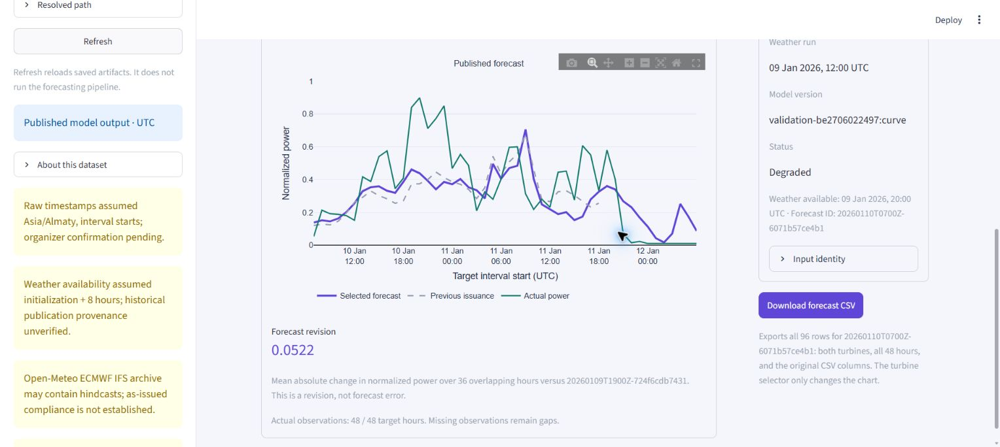
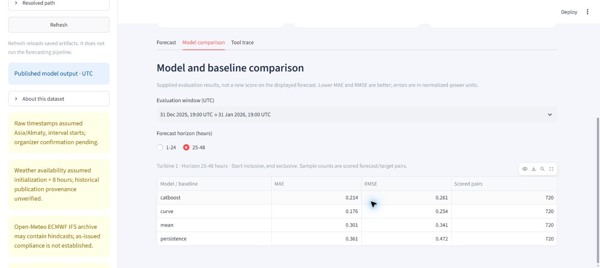
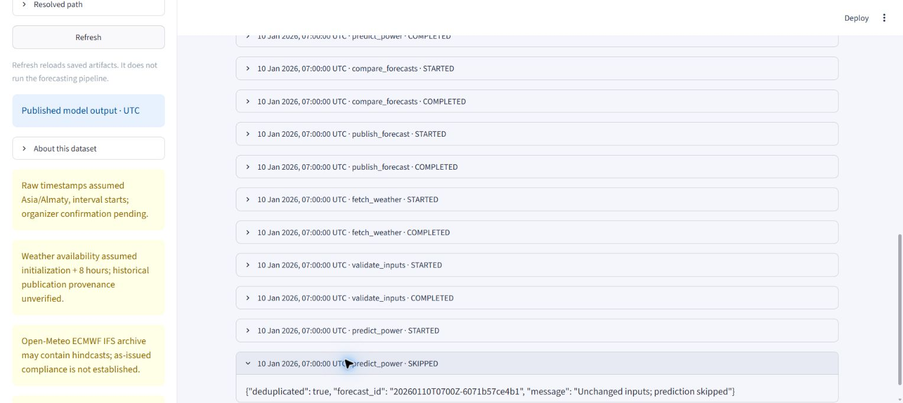

# Dashboard finalization evidence — 23 September 2026

Presentation choice: **Horizon**, retained in the rehearsal browser. The forecast and provenance rail support a short demonstration without changing the underlying calculations. Horizon is now the only available design; the selector and alternative layouts have been removed. The multi-design checks below describe the earlier tested snapshot.

## Tested revision and environment

- Tested code: `c8ff698f4e7e9a0a040281a18bf81ed1c679741c` on `codex/dashboard-finalization`.
- Integrated base: `60dda20f902b1517747ae57c847fd55cc306ec4a`, combining main `03f90bb` and dashboard design PR #7. PR #7 was still open during verification; this is the combined snapshot, not a claim that designs were already on main.
- Native Windows 11, build 26200, x64; CPython 3.12.13; `sys.flags.utf8_mode == 0`; locale encoding **cp1251**. No `-X utf8` option was used.
- Pinned project dependencies installed with `python -m pip install -r requirements-dev.txt`. This uv-created environment initially lacked pip; `python -m ensurepip` installed it before the documented installation command succeeded.
- `python -m pytest -q`: **26 passed, 13 subtests passed** (7.38 seconds on the recorded run).
- `python -m pip check`: no broken requirements found.

## Native offline execution

```powershell
.\.venv\Scripts\python.exe -m src demo --output outputs/final-rehearsal-20260923
.\.venv\Scripts\python.exe -m src demo --output outputs/final-rehearsal-20260923
$env:CINDRELO_OUTPUT_DIR = "outputs/final-rehearsal-20260923"
.\.venv\Scripts\python.exe -m streamlit run app.py --browser.gatherUsageStats false
```

The previously unused directory received two versions and **192 forecast rows**, with matching actuals, metrics, manifest and events. The second invocation reported unchanged-input deduplication for both versions. The forecast CSV SHA-256 was identical before and after the repeat:

```text
67657c8a4bbb7c797952638f09a95e632afa0decd389e05327634a5d42c8ab97
```

The native run exposed an overly strict portability assertion: nine CSV power strings differed from the macOS fixture at the final rounding digit. Maximum parsed difference was `1.1102230246251565e-16`. The test now compares only power numerically with `rtol=0, atol=1e-14`; identifiers, timestamps and every other original column remain exact. Repeat-run bytes and corruption/checksum tests remain exact. No prediction code, fixture values or cache hashes were changed.

## Browser verification

Verified in Microsoft Edge on native Windows against the newly generated directory:

- Published model output, degraded status and source warnings are visible.
- Turbine 1 and Turbine 2, both issuances, and the no-previous-overlap state work.
- Latest revisions use **36 overlapping hours**: Turbine 1 **0.0522**, Turbine 2 **0.0515**. Both latest windows have 48/48 observations. Toggling actuals removes/restores the plotted line.
- Horizon → Control room → Field report → Horizon preserves Turbine 2 and the earlier issuance; the presentation was then restored to Horizon, Turbine 1 and the latest issuance.
- Model comparison displays the supplied evaluation window and changes between 1–24 and 25–48 hours. These filtered rows are not the pooled January MAE.
- Tool trace expands the genuine deterministic repeat event: `predict_power · SKIPPED`, “Unchanged inputs; prediction skipped.” This was an offline controller run, not a new OpenAI call.
- Chart margins were corrected after browser inspection found clipped axis labels. Complete ticks, units and UTC target labels are now readable.
- No browser console errors were returned by the final error-log check.

### Browser save-to-disk: pending user-assisted location check

The Edge **Download forecast CSV** button was clicked for `20260110T0700Z-6071b57ce4b1`. No matching file was found in the default Windows Downloads directory. The browser automation policy blocks `edge://downloads/`; the direct file-download capability also did not return a saved file. The user was asked to finish any save prompt and provide the full saved path.

**Do not mark this acceptance item complete yet.** Valid export bytes and HTTP delivery from earlier checks are not a substitute for opening a browser-saved file. When the saved path is provided, open that exact CSV and verify 96 data rows, 48 per turbine, unique turbine/target keys and every original column/value for the selected forecast. Do not regenerate the file into Downloads and describe it as a browser save.

## Presentation screenshots

These show real January model output and retain source limitations. They are evidence of the UI state; CLI results and tests above establish offline execution.







## Three-minute team handoff

Use the timing in [the finalization checklist](FINALIZATION_CHECKLIST.md#5-both-three-minute-rehearsal). The dashboard portions have been exercised; the joint timed run and teammates' spoken explanations remain a team activity, not a completed live-agent rehearsal.

- **0:00–0:30:** Two turbines; normalized power rather than energy or MW. Open Horizon on the latest forecast.
- **0:30–1:30:** Backend teammate runs the agent CLI on their machine. Refresh only after publication completes, show the weather/model provenance and 36-hour revision overlap. If API access fails, explicitly identify the offline controller or saved trace being shown.
- **1:30–2:00:** January pooled MAE: curve 0.1669, persistence 0.3340. December selected the curve before January evaluation. Explain that individual table rows differ from pooled scores.
- **2:00–2:30:** Show the committed February day-ahead submission and the verified offline example. Demonstrate browser download once the saved-file check above is completed.
- **2:30–3:00:** Disclose assumed timezone/interval convention, assumed eight-hour weather delay, unverified as-issued provenance and no February actuals. Do not claim February accuracy.

Backend live calls, full February replay, organizer clarification and final submission receipt remain with the backend owner. The committed February table is available under `examples/submission/`; it is not a complete dashboard directory.
