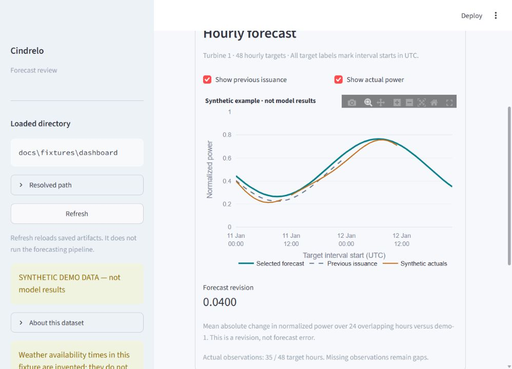
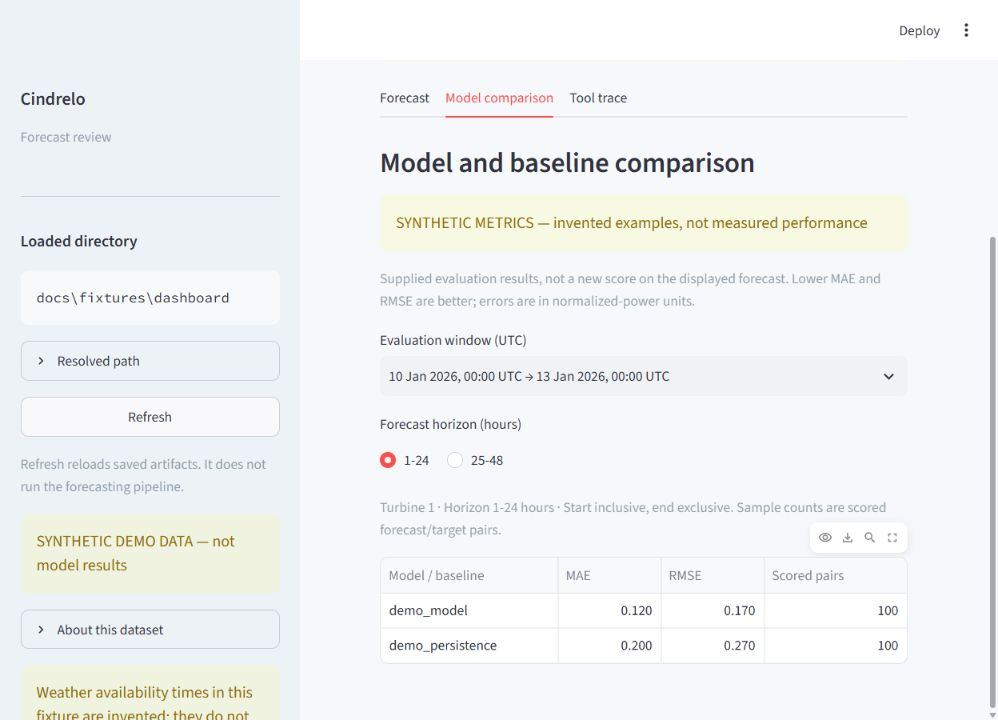
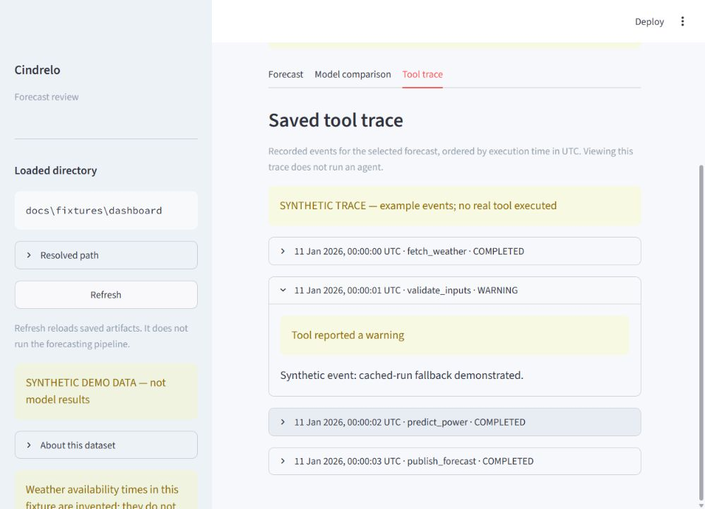

# Cindrelo dashboard demo

This dashboard displays the files defined in [TEAMMATE_SPEC.md](TEAMMATE_SPEC.md) and can execute the full forecasting cycle with **Run forecast cycle**. The default fixture is synthetic: every number is invented for interface development. It is not a model result or measured validation performance. A successful cycle switches the view to its real model output.

The dashboard uses **Horizon**, the selected presentation design. Use the Forecast, Model comparison and Tool trace tabs. See the [Horizon design guide](DESIGNS.md).

**Final presentation:** use Horizon. The [native Windows finalization report](DASHBOARD_FINALIZATION.md) records the no-UTF-8-flag test run, deduplication hashes, real-data screenshots and the remaining browser-save check. It supersedes the historical Windows workaround and test counts below.

## Start

Use Python 3.11 or newer. From the repository root:

```sh
python -m venv .venv
# macOS/Linux:
source .venv/bin/activate
# Windows PowerShell:
.venv\Scripts\Activate.ps1
python -m pip install -r requirements-ui.txt
python -m streamlit run app.py --browser.gatherUsageStats false
```

Open the local URL printed by Streamlit. Viewing saved files needs no API key or external network. To use the run button, also install `requirements-backend.txt`; live mode requires `OPENAI_API_KEY` in the local ignored `.env` file. The cycle uses an existing trained model and does not retrain it.

To use backend artifacts in PowerShell:

```powershell
$env:CINDRELO_OUTPUT_DIR = "outputs/dashboard"
python -m streamlit run app.py --browser.gatherUsageStats false
```

On macOS/Linux:

```sh
CINDRELO_OUTPUT_DIR=outputs/dashboard python -m streamlit run app.py --browser.gatherUsageStats false
```

Relative data paths resolve from the app's repository directory, regardless of the caller's working directory. Launch from the repository root to load its Streamlit theme configuration. The sidebar shows the resolved directory. After an external CLI run finishes, select **Refresh** to reload its files. The run button selects its completed snapshot automatically. A bad override displays an actionable filename-specific error; it never silently uses the fixture instead.

## One-click agent demonstration

Start against `examples/dashboard` with both backend and UI dependencies installed. Keep the default **Run options**: first issuance 9 January 2026, 19:00 UTC, live OpenAI agent and automatic revision 12 hours later.

1. Press **Run forecast cycle** once. Expand progress to show actual weather retrieval, data preparation, validation, model prediction, revision analysis and publication events.
2. The same action advances the simulated clock and repeats those steps with the newer eligible archived weather run. Both forecasts have 48 hours for each turbine: 192 rows in total.
3. On completion, the dashboard automatically selects 10 January, 07:00 UTC. Show the dashed previous issuance and the change across 36 overlapping hours per turbine. Explain that this demonstrates a historical update, not a background scheduler or today's forecast.
4. Open **Tool trace**. The new events belong to the run just executed. `weather_source` identifies external retrieval or a verified cached fallback; fallback carries a visible warning.
5. Repeat the button press to demonstrate deduplication. Unchanged weather/model inputs reuse forecasts while actual observations refresh. The trace records prediction skips.

For a network-free fallback, select **Offline deterministic rehearsal (cached weather)** in Run options. It executes the same guarded numerical tools without an LLM; describe it as an offline rehearsal. Missing keys, backend dependencies or failed cycles produce an error and preserve the previous displayed forecast. Completed runs appear under `outputs/dashboard-runs/<session>/snapshot-<id>/`.

Source timezone, interval convention and historical weather availability remain assumptions. Show **Degraded** status and the source warnings. The run uses the existing trained model; future actuals are displayed for comparison and are not model inputs.

Verified on macOS in Chrome with a dark OS preference: the live button retrieved four external weather responses, completed both OpenAI-controlled forecasts, selected the latest result and saved its 96-row CSV through the browser. All 192 predictions matched the committed January example values. The combined suite passes 39 tests and 12 subtests, including offline cycles, deduplication, observation updates and failed-publication recovery.

## Real-data rehearsal (2–3 minutes)

Use the [Windows UTF-8 commands in README.md](../README.md#windows-powershell-enable-utf-8) to generate `outputs/offline-demo/` and start the dashboard against that directory. On other platforms, run `python -m src demo` and set `CINDRELO_OUTPUT_DIR=outputs/offline-demo`. Use `examples/dashboard` when presenting the saved live-agent traces. Offline regeneration uses the deterministic controller and must not be described as a new OpenAI agent run.

1. **0:00–0:30:** Point out **Published model output**, the source directory and **Degraded** status. Explain that raw timezone and historical weather availability remain assumptions; power is normalized, not MW/MWh.
2. **0:30–1:10:** Select the latest issuance, 10 January 2026 at 07:00 UTC. Toggle the dashed previous issuance: there are 36 overlapping hours. Turbine 1 revision is 0.0522; Turbine 2 is 0.0515. Both latest forecast windows have actual observations. Explain that revision measures changed forecasts, not accuracy.
3. **1:10–1:40:** Open **Model comparison**, change the horizon bucket and turbine, and read the January evaluation window. The pooled January MAE is 0.1669 for the curve versus 0.3340 for persistence; individual filtered table rows differ from that pooled score. No February accuracy is available.
4. **1:40–2:15:** Open **Tool trace** and expand a completed prediction or publication. After repeating the offline CLI demo, show `predict_power · SKIPPED` with “Unchanged inputs; prediction skipped.” Displayed timestamps come from the replay scenario; wall-clock execution times are recorded separately in the source events.
5. **2:15–2:45:** Return to **Forecast**, change issuance, download the selected 96-row CSV for both turbines, and use **Refresh** after a complete published snapshot. Explain that Refresh reads files and does not execute the agent.

### Integration rehearsal — 23 September 2026

- Python 3.12 on Windows, using `-X utf8`: combined backend/UI suite passes **22 tests plus 10 subtests**.
- Offline regeneration reproduces all 192 committed example predictions exactly. A second run deduplicates both versions; forecasts remain unchanged and skipped events appear in the UI.
- The dashboard accepts regenerated forecasts, actuals, metrics and events. Both CSV payloads preserve all 96 rows and both turbines. Browser checks exercise real-data forecast, metrics and saved trace views.
- Full February replay and a new live OpenAI call were not repeated in this rehearsal. The committed portable examples cover January only; the full February export must be supplied or reproduced from the full weather/model artifacts before final submission. Existing recovery evidence is in `examples/backend/recovery-events.jsonl` and explicitly labels the injected failure.
- Browser file-saving remains a manual check in this environment; CSV generation is verified independently.

## Synthetic fixture walkthrough (2–3 minutes)

1. Point out the prominent **SYNTHETIC DEMO DATA — not model results** banner.
2. Select Turbine 1 or Turbine 2. The newest issuance is selected initially; the forecast ID distinguishes versions.
3. Hover over the chart. Values are hourly normalized power in [0,1], never MW/MWh. All application times are UTC; target labels mark the start of the hour.
4. Leave the latest issuance selected. Toggle **Show previous issuance**: its dashed line covers only the 24 shared target hours. For Turbine 1, **Forecast revision** is 0.0400 normalized power. This measures a change between forecasts, not forecast error.
5. Toggle **Show actual power**. The fixture has 35 observations across the latest Turbine 1 forecast's 48 hours; missing observations remain gaps. A period without observations shows **Actuals unavailable**.
6. Inspect issue time, weather run, availability, model version, input identity and status. Warnings and degraded forecasts remain visible.
7. Open **Model comparison**. Select a horizon bucket and inspect the supplied model/baseline metrics for the selected turbine and evaluation window. These synthetic scores are invented examples; the dashboard does not score the displayed forecast.
8. Open **Tool trace**. Events appear chronologically for this forecast, with warnings and failures expanded. Point out the cached-run example and the synthetic trace disclosure. These are saved events, not a live execution.
9. Return to **Forecast** and download the selected forecast CSV. It includes the original columns and 96 rows: 48 target hours for each of both turbines, irrespective of the chart's turbine selector. Switch to the earlier issuance to see the no-previous-forecast state.

## Verification and integration

- Fixture has 192 forecast rows in two published versions. Selecting either version exports 96 rows with the source columns intact.
- Selectors change chart and metadata; Refresh only reloads files.
- Revision joins use target timestamps, including when source rows are shuffled. Same-time forecast versions remain separately selectable; ambiguous versions at the previous issuance get an explicit selector.
- Actuals join on turbine and target timestamp. Missing observations break the line, including when every observation is absent. February 2026 periods without observations include an explicit unavailability note.
- Header-only actuals and metrics files, and an empty events file, render helpful empty states. Event messages render as plain text. Failed unpublished runs remain visible in the sidebar.
- Missing files, unsupported manifest versions, invalid UTC timestamps, duplicate forecast keys, invalid power/horizon values and unavailable-at-issuance weather produce clear errors.
- Unknown extra forecast columns are preserved in downloads. Backend output replaces the fixture by setting the directory; no UI code changes are needed. Both committed and freshly regenerated real backend examples have passed integration checks.

Tested from a fresh Python 3.12 environment with the pinned requirements: Streamlit 1.64.0, pandas 3.0.6 and Plotly 7.1.0. Run the 12 contract/interaction tests from the repository root:

```sh
python -m unittest ui.test_contract -v
```

The tests use temporary artifact copies and leave the shared fixture untouched. They cover alignment, original-column exports, invalid inputs, empty files, source-directory overrides, selector changes and Refresh reloading. Browser checks cover all three tabs, the horizon filter and overlay controls, including a narrow desktop layout. The running server returned the selected CSV with HTTP 200, the expected attachment filename, and all 96 source rows. This environment's automated Chromium save operation reported a canceled download, so browser file-saving remains a manual verification item.

For backend handoff, publish all five contract files into one directory, set `CINDRELO_OUTPUT_DIR`, restart the dashboard and select **Refresh** after subsequent complete snapshots. Mark real artifacts `model_output` in the manifest and disclose availability assumptions through its warnings or the run events. The UI never substitutes fixture files for an invalid configured directory.

## Screenshots








These screenshots show the earlier saved-artifact interface. The current dashboard also has the working **Run forecast cycle** control described above. Merely opening saved files or pressing Refresh does not execute the agent.
