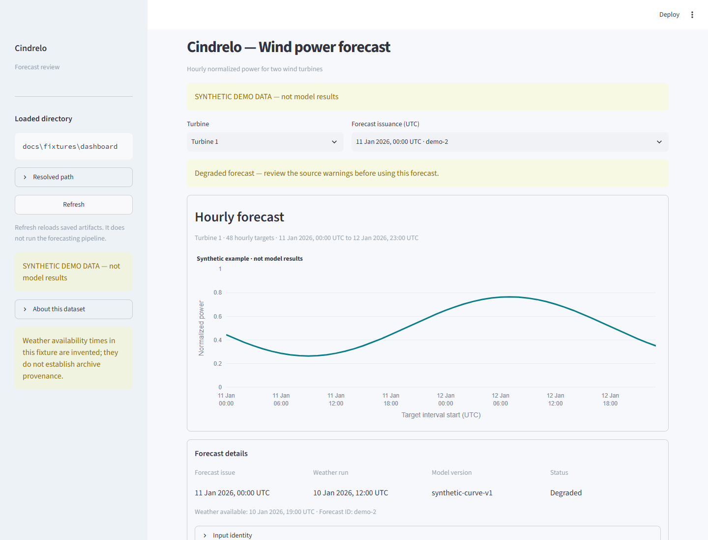

# Cindrelo dashboard demo

This read-only dashboard displays the files defined in [TEAMMATE_SPEC.md](TEAMMATE_SPEC.md). The default fixture is synthetic: every number is invented for interface development. It is not a model result or measured validation performance.

## Start

Use Python 3.11 or newer. From the repository root:

```sh
python -m venv .venv
# macOS/Linux:
source .venv/bin/activate
# Windows PowerShell:
.venv\Scripts\Activate.ps1
python -m pip install -r requirements-ui.txt
python -m streamlit run app.py --browser.gatherUsageStats false
```

Open the local URL printed by Streamlit. Installation requires package access; normal dashboard use needs no API keys or external network. It reads local files and does not fetch weather, train a model, or execute an agent.

To use backend artifacts in PowerShell:

```powershell
$env:CINDRELO_OUTPUT_DIR = "outputs/dashboard"
python -m streamlit run app.py --browser.gatherUsageStats false
```

On macOS/Linux:

```sh
CINDRELO_OUTPUT_DIR=outputs/dashboard python -m streamlit run app.py --browser.gatherUsageStats false
```

Relative data paths resolve from the app's repository directory, regardless of the caller's working directory. Launching from elsewhere is supported by passing the absolute path to `app.py`. The sidebar shows the resolved directory. After the backend publishes a complete snapshot, select **Refresh** to reload the files. A bad override displays an actionable filename-specific error; it never silently uses the fixture instead.

## Forecast screen walkthrough (about one minute)

1. Point out the prominent **SYNTHETIC DEMO DATA — not model results** banner.
2. Select Turbine 1 or Turbine 2. The newest issuance is selected initially; the forecast ID distinguishes versions.
3. Hover over the chart. Values are hourly normalized power in [0,1], never MW/MWh. All application times are UTC; target labels mark the start of the hour.
4. Inspect issue time, weather run, availability, model version, input identity and status. Warnings and degraded forecasts remain visible.
5. Download the selected forecast CSV. The file includes the original columns and 96 rows: 48 target hours for each of both turbines, irrespective of the chart's turbine selector.

## Initial acceptance

- Fixture has 192 forecast rows in two published versions. Selecting either version exports 96 rows with the source columns intact.
- Selectors change chart and metadata; Refresh only reloads files.
- Missing files, unsupported manifest versions, invalid UTC timestamps, duplicate forecast keys, invalid power/horizon values and unavailable-at-issuance weather produce clear errors.
- Backend output can replace the fixture by setting the directory; no UI code changes are needed.

Tested with Python 3.12, Streamlit 1.64.0, pandas 3.0.6 and Plotly 7.1.0. Streamlit AppTest passed latest-default, turbine-change and issuance-change checks. Chromium rendered the screen without page/console errors. The running server returned the selected CSV with HTTP 200, the expected attachment filename, and all 96 source rows. This environment's automated Chromium save operation reported a canceled download, so browser file-saving remains a manual verification item.



Evidence/revision views are the next dashboard increment. There is deliberately no Run agent control: inspecting saved artifacts does not mean an agent has just executed.
