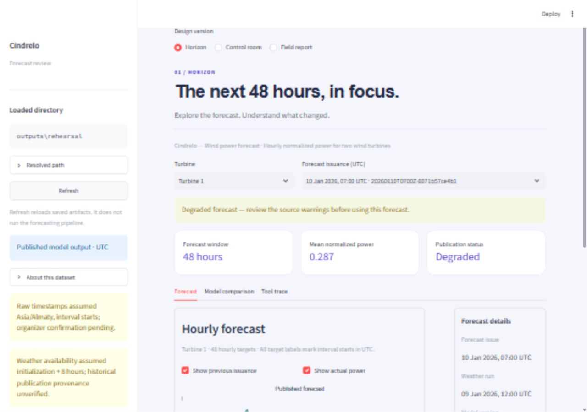
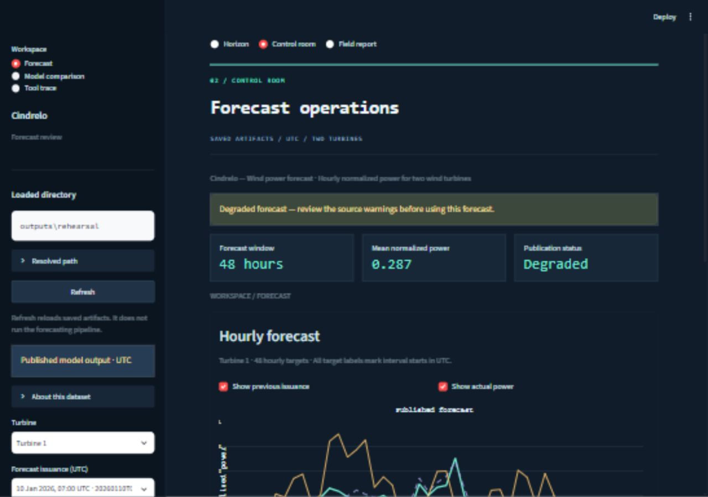
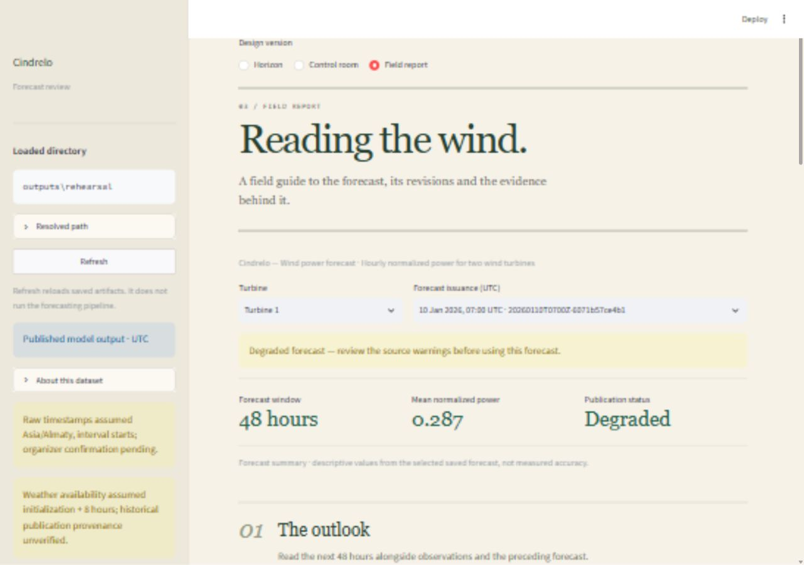

# Three dashboard directions

Start the dashboard using [the Windows UTF-8 instructions](../README.md#windows-powershell-enable-utf-8) or the [demo guide](DEMO.md). Select **Design version** at the top of the page. All three versions use the configured artifact directory, preserve the selected turbine and forecast, and share the same validation, revision calculations and original-column CSV exports.

| Version | Visual direction | Interaction model | Best fit |
|---|---|---|---|
| **Horizon** | Bright ivory/white panels, violet accents, sans-serif typography | Summary cards, tabs, chart with a separate provenance/export rail on wide screens; stacked on narrow screens | Comparing forecasts and checking evidence quickly |
| **Control room** | Deep navy, mint/copper chart lines, monospace headings, compact square panels | Persistent sidebar workspace navigation and forecast selectors; one task at a time | Repeated operational review |
| **Field report** | Warm paper, forest green, serif headlines, numbered chapters | Continuous narrative: outlook, model evidence, saved record; expandable supporting sections | A guided judge/demo presentation |

## Review script

1. Choose each version and inspect the same latest forecast. **Mean normalized power** is a descriptive forecast average, not an accuracy measure. Revision and supplied metrics keep their original meanings.
2. Switch turbines, inspect provenance, toggle previous/actual overlays and download the forecast CSV. Selection is retained when switching designs.
3. In Horizon, use the three tabs. In Control room, open the sidebar with the top-left chevron if it is collapsed, then use **Workspace**. In Field report, scroll through the numbered chapters and expand the saved record.
4. Compare the same evaluation window and horizon in each design. Source assumptions, synthetic disclosures, degraded status and failures remain visible.

Screenshots below show published January model output. Historical weather provenance remains unverified and the forecasts are degraded. Synthetic fixtures retain their separate synthetic banners in every version.

## Horizon

## Control room

## Field report

## Verification

Run `python -X utf8 -m pytest -q` on Windows. Design interaction coverage checks selection preservation, synthetic disclosure, revision availability and Control room navigation across its three workspaces. Existing contract tests continue to cover export contents, time alignment, missing actuals, empty evidence files and malformed input errors. No new dependencies or backend contract changes are introduced.
