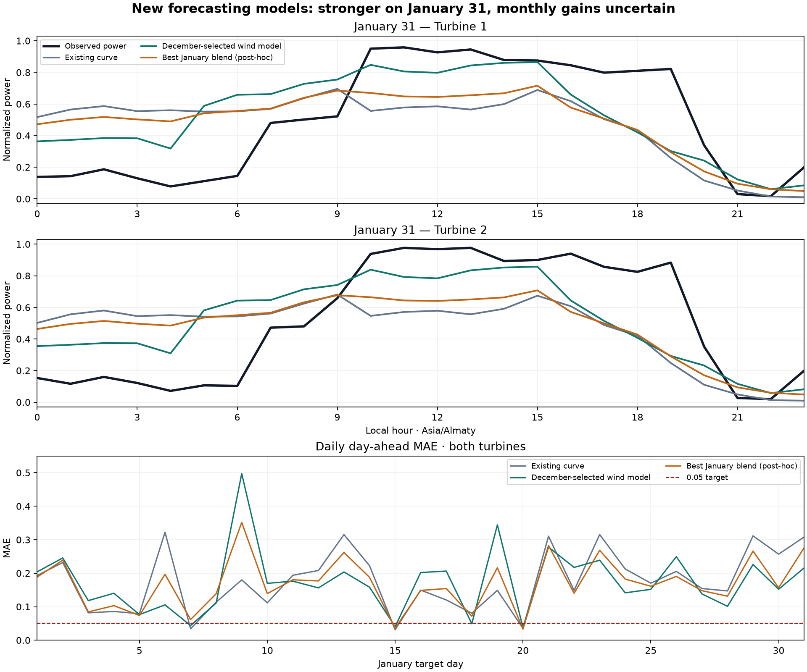

# Fresher forecast inputs: a better December-selected challenger

Tested 23 September 2026. The new December-selected method reduces January 31 MAE by **29.92%**, from **0.308140 to 0.215940**, and full-January MAE by **1.53%**, from **0.176782 to 0.174079**. This is useful progress, but the requested **0.05** threshold remains unmet. Production forecasts remain unchanged.

## Results on the same complete January target set

| Recipe | Selection: December 1–29 | Full January | January 31 |
|---|---:|---:|---:|
| Existing empirical curve, with two-hour training-label delay | 0.219982 | 0.176782 | 0.308140 |
| **December-selected multi-provider wind CatBoost → empirical curve** | **0.197417** | 0.174079 | **0.215940** |
| Direct multi-provider CatBoost | 0.198732 | 0.174054 | 0.247562 |
| Direct CatBoost with calendar features | 0.200339 | 0.178034 | 0.244993 |
| Fixed 50/50 calendar-CatBoost / curve blend | 0.200161 | **0.169284** | 0.276378 |
| Fixed 50/50 calendar-histogram / curve blend | 0.202897 | 0.171704 | 0.274439 |
| December-selected long-sequence histogram / curve blend, separate experiment | 0.219177 | 0.176223 | 0.253074 |

Every January score covers **1,488 identical hourly turbine targets**, 744 per turbine. January 31 covers 48. December has 1,474 scored pairs because 14 hourly turbine records are incomplete; missing actuals are not filled. All scores measure normalized power at horizons 25–48: target interval starts 24–47 hours after issuance.



The 50/50 calendar-CatBoost blend gives the best January result in this batch, a **4.24% reduction**. Its weight was fixed before evaluation, but highlighting it as the monthly winner after viewing January is still **post-hoc selection**. The pre-January winner is wind CatBoost, not this blend. January has been repeatedly inspected during research and is not an independent holdout anymore.

For comparison with older January 2–31 benchmarks, wind CatBoost scores **0.173076** and the calendar-CatBoost blend **0.168641**, versus the same delayed curve's **0.176235**. The preceding best model-family blend was 0.172369 on January 2–31, with January 31 0.258783. The fresh calendar blend improves that monthly score but gives a worse January 31 score; no single recipe dominates every comparison.

## What changed

Added 48-hour-offset GFS, ICON and JMA forecast archives to the existing 72-hour-offset archive. For each target, use the fresher input only when

`valid_time - 48 hours + 8 hours <= issued_at`.

Thus horizons 25–41 use the 48-hour offset; horizons 42–48 retain 72-hour data. All raw offset columns are discarded before computing neighboring-hour shifts and daily trajectory summaries, preventing an unavailable weather update from entering indirectly through another target. The selected offset and its availability bound remain in row-level outputs.

The eight-hour weather publication delay is an assumption. [Open-Meteo Previous Runs](https://open-meteo.com/en/docs/previous-runs-api) documents fixed lead offsets, but does not return exact initialization/publication timestamps here. These inputs are **conditionally eligible research data**, not verified historical as-issued forecasts. The unsupported JMA 100 m wind column is excluded using training-only availability; other requested weather columns are complete. Each offset contains 11,760 location-hour rows from June through January.

Six fixed unblended recipes test CatBoost or histogram MAE boosting, physical versus calendar features, delayed live summaries, and wind prediction followed by the empirical power curve. Two fixed 50/50 blends are also included, alongside the curve control. Provider trajectory features use only forecasts conditionally available at the same issuance. Training uses day-ahead rows, which differs from the older provider benchmark that also fitted short-horizon rows; the improvement cannot be attributed to freshness alone.

CatBoost uses 350 iterations, depth 5, learning rate 0.03, L2 penalty 10 and MAE loss. Histogram boosting uses 300 iterations, 15 leaves, minimum leaf size 40, L2 penalty 10 and no random early-stopping split. Both use seed 42 and two CPU threads. Imputation and feature support are fitted on training data only.

## Training, selection and uncertainty

Both fitted labels and live observations require the hourly interval to finish plus **two reporting hours**. January 1 uses a model fitted at its December 31 midnight issuance; January 2–31 uses the January 1 midnight model. Neither fit sees January targets. The empirical-curve control follows the same cutoffs and delay.

Selection uses December 1–29, whose labels arrive before the December 31 issuance. Full December results are reported separately. This fixes the boundary problem that would arise from selecting on December 31 observations for a forecast already issued that morning.

Paired 1/3/7-day block-bootstrap diagnostics are saved in `examples/fresh-provider-benchmark/uncertainty.json`. They are exploratory, not adjusted for the many research comparisons. January 31 alone provides only one day, so its 29.92% reduction is a measured day-specific improvement, not evidence of a general 30% gain.

The selected wind model's full-January absolute MAE gain is 0.002702; its three-day-block 95% interval is **[-0.035272, 0.037931]**. The post-hoc blend's gain is 0.007498, with interval **[-0.014091, 0.026059]**. Every tested block length includes zero. Both turbines improve in aggregate, but lead-specific results differ: the selected model worsens horizons 25–41 by 9.23% and improves horizons 42–48 by 22.52%. Since the larger gain occurs where the older 72-hour input is retained, these results do not establish that freshness itself caused the improvement.

The [independent audit](ACCURACY_GOAL_AUDIT.md) and [sequence benchmark](SEQUENCE_BENCHMARK.md) explain why further progress needs better wind trajectories. The measured-future-wind diagnostic remains explicitly unavailable hindsight. This experiment does not establish that 0.05 is attainable.

## Reproduction and review

```powershell
python -m pip install -r requirements-research.txt
python -m src.provider_weather --offset-days 2 --output outputs/provider-weather-day2
python -m src.fresh_provider_benchmark --output outputs/fresh-provider-benchmark-repeat
python -m pytest tests/test_fresh_provider_benchmark.py tests/test_sequence_benchmark.py -q
```

Requires the original turbine data, prior ECMWF research exports and 72-hour provider archive described in [the provider benchmark](PROVIDER_BENCHMARK.md). Use a new benchmark output directory. Checksummed raw API responses stay in ignored `data/provider-weather/`; full predictions stay under `outputs/`. Compact metrics, frozen selection, protocol, uncertainty, comparisons and hashes are committed under `examples/fresh-provider-benchmark/`. No production model, February export or dashboard output is overwritten.
