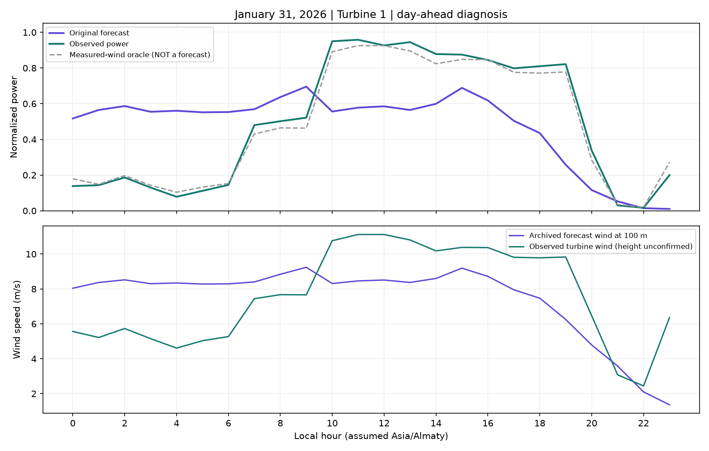

# January 31 diagnosis and forecasting-method experiments

Executed 23 September 2026. **No significantly better method was established.** Twenty-two new challengers across two 12-recipe batches (each including the original curve) were tested. Each batch selected its winner using December only, then evaluated that fixed recipe on January. Both winners regressed; the original January 31 and February 1 forecasts remain unchanged.

## Why January 31 was poor

Across both turbines, daily average forecast power was 0.4692 versus actual 0.5006, but hourly MAE was 0.30814. The problem is primarily the intraday shape:

| Local hours | Forecast power | Actual power | Forecast 100 m wind | Measured turbine wind |
|---|---:|---:|---:|---:|
| 00–06 | 0.5506 | 0.1262 | 8.306 m/s | 5.203 m/s |
| 10–19 | 0.5335 | 0.8983 | 8.183 m/s | 10.608 m/s |

The forecast overpredicts early wind and misses the later rise. A constant bias adjustment cannot correct opposite-signed errors in the same day.

Feeding the frozen curve the **measured target-hour wind** gives MAE **0.03083**. This is a hindsight diagnostic that uses future information, not a forecast, achievable accuracy claim or guaranteed improvement bound. It suggests the measured-wind power relationship works well on this particular day; the forecast-to-measured-wind mapping and weather evolution are the larger problems. Sensor height, source timing and archive provenance remain assumptions, so this is not proof that the NWP model alone caused every error.



## Methods actually tested

The static batch adds wind shear, vector wind components and neighbouring **forecast** wind values from the same issuance. It compares wind-speed postprocessing with MAE/RMSE CatBoost followed by the empirical curve, direct power prediction, physical-feature variants, direction-sector bias correction and 50-neighbour weather analogues. Neighbouring weather targets are known forecasts, never future observations.

The second batch follows the user's permission to use observations already available before issuance. It tests damped 6/24-hour wind-bias correction and learned power/wind models with lagged telemetry. Measurements become available only after the measured hour ends **plus two reporting hours**. Six-hour summaries use exactly six eligible target starts. Data older than five hours after interval end trigger neutral correction or the original-curve fallback. Training and January evaluation apply the same availability rule.

The two-hour delay is an explicitly chosen conservative experiment assumption, not a measured telemetry SLA. January target observations never enter fitting or December model selection. Earlier January observations may enter later January forecasts only after their availability timestamp, as authorized.

Both new batches expand archived-weather training to June–November for December selection and June–December for January evaluation. This differs from the original CatBoost recipe's September start; it is a deliberate candidate change. The already-documented August archive gaps are retained. Original curve training retains the longer pre-cutoff turbine history.

## December-selected results

| Recipe | December day-ahead MAE | January day-ahead MAE | January 31 MAE |
|---|---:|---:|---:|
| Original curve | 0.228440 | **0.176235** | **0.308140** |
| Static wind calibration, RMSE depth 4 | **0.205988** | 0.189657 | 0.335940 |
| Live-input wind calibration, MAE depth 6 | 0.209070 | 0.180909 | 0.363502 |

Static calibration improves December by 9.83% but worsens January by 7.62%. Live-input calibration improves December by 8.48% but worsens January by 2.65% and January 31 by 17.97%. There was no post-January search for a different winner within either batch.

Scores preserve the original issuance-window protocol: evaluation origins start at the first local midnight of the month, and targets must end inside that month. January day-ahead therefore scores January 2–31, 720 hours per turbine. This allows every January forecast in this comparison to use the model trained through December without backdating its cutoff to December 31. These scores should not be compared directly with earlier experiments' 744-hour January day-ahead totals. January 31 itself has the same complete 48-pair coverage in all comparisons.

An initial live-input run had inclusive windows containing seven rather than six hours. It was retained as an initial result, then corrected and rerun in a new output directory. The corrected result is shown above; the same model family won both runs, and both failed January. No numerical result from the initial run is substituted into the final table.

## Decision

Do not deploy these challengers or regenerate February with them. The earlier 50/50 curve/direct-median blend remains an exploratory shadow candidate with modest gains, not evidence of a significant January 31 fix. January has now been repeatedly inspected; further tuning against it is research, not untouched-test validation.

The next experiment should change the weather information available at issuance (verified alternative archived runs/providers or an issuance-safe spatial weather correction), rather than continue retuning the same power mapping against this day. Such an experiment needs compatible historical coverage and publication-time provenance before a fair December-selection/January comparison. No promised MAE reduction follows from the hindsight measured-wind diagnostic.

## Artifacts and verification

- `src/weather_calibration.py`: static weather/trajectory experiment.
- `src/live_bias.py`: two-hour-delay telemetry features and candidate experiment.
- `examples/weather-calibration/`: static and live batch protocols, rankings, metrics, reports, diagnosis and hashes.
- Local full predictions: `outputs/weather-calibration/` and `outputs/live-bias-final/`; these are research outputs, not dashboard replacements.

Run after acquiring the round-one/round-two weather caches:

```powershell
python -m src.weather_calibration --output outputs/weather-calibration-repeat
python -m src.live_bias --output outputs/live-bias-repeat
python -m pytest -q
```

The weather table is assembled from the earlier research exports, with issuance/target/turbine duplicates removed. Its August exclusions are documented in the round-two report. New output directories are required. Tests cover future-observation invariance, exact reporting windows, stale telemetry, and trajectory features not crossing issuance boundaries or reading actual power.
